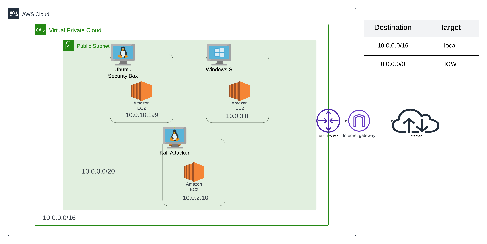

# Cloud HomeLab

## Overview
The **Cloud HomeLab** project is designed to simulate a complete cybersecurity environment hosted on AWS. It consists of multiple instances representing different systems: a security monitoring box, an attacker (Kali Linux), and a Windows Server/Workstation. The goal is to create an environment for practicing vulnerability scanning, incident detection, and log management using tools like Splunk and Tenable Nessus.

## Architecture

This lab setup consists of the following components:

- **AWS VPC (Virtual Private Cloud)**: Segmented network for hosting the home lab infrastructure.
- **Ubuntu Server (Security Box)**: For log management and monitoring.
- **Kali Linux**: Attacker machine for penetration testing and offensive security tasks.
- **Windows Server/Workstation**: For practicing Active Directory (AD) security, Group Policy, and simulating enterprise workstations.
- **Splunk**: Used for log collection, SIEM, and real-time security monitoring.
- **Tenable Nessus**: Vulnerability scanner used for detecting misconfigurations and security flaws.

